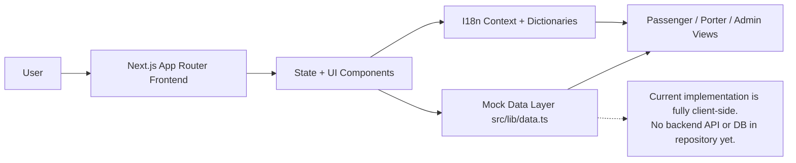

<div align="center">


<h1>
  <span style="background: linear-gradient(90deg,#fb923c,#f97316,#f59e0b); -webkit-background-clip:text; color:transparent;">COOLIE</span>
</h1>


<br/>


</div>

---


## ⚡ Tech Stack

> Stack below is extracted from the current codebase (`package.json`, configs, and source files).

### Frontend
<p>
  
</p>

### Animation & UI


### Backend / Database / APIs
- **Backend:** No server/API routes implemented yet (client-side app).
- **Database:**No database integration yet.
- **External APIs:** None currently used.
- **Data Source:** Local mock data (`src/lib/data.ts`).

### Tools
<p>
  
</p>

---


## 🎯 Real Features (from code)

- 🎨 **Modern animated landing page** with GSAP reveal effects and Framer Motion transitions.
- 🧳 **3D hero visual** (interactive suitcase scene) rendered with Three.js.
- 📊 **Stats section** with key platform metrics (mocked).
- 🌐 **Multilingual UI** (`en`, `hi`, `ta`, `te`) with dictionary-driven content and runtime language switching.
- 🌙 **Dark mode toggle** persisted in `localStorage`.
- 👤 **Passenger booking flow** with:
  - PNR input validation (10-digit numeric)
  - Station + drop location selection
  - Porter selection and price negotiation
  - Payment method selection (UPI/Card/Wallet)
  - Booking confirmation view
- 🧑‍🔧 **Porter dashboard** with:
  - Incoming job request handling (accept/decline)
  - Earnings and completion KPIs
  - Job history and ratings views
- 🛠️ **Admin panel** with:
  - Booking/porter tabs
  - KPI cards
  - Search and status filtering visuals
  - Desktop table + mobile card adaptations

---

## 🧠 System Architecture



---

## 🖥️ Live Preview

<p align="center">
  
</p>

<p align="center">
  
</p>

---

## ⚙️ How It Works

### Passenger Flow
`Enter PNR & Station` ➜ `Choose Porter` ➜ `Confirm Details` ➜ `Pay` ➜ `Booking Confirmed`

### Porter Flow
`Receive Job Requests` ➜ `Accept/Reject` ➜ `Complete Trip` ➜ `Track Earnings & Ratings`

### Admin Flow
`Review KPIs` ➜ `Search Bookings/Porters` ➜ `Monitor Status & Revenue`

---

## 📁 Project Structure

```bash
COOLIE/
├── public/
├── src/
│   ├── app/
│   │   ├── admin/page.tsx
│   │   ├── book/page.tsx
│   │   ├── porter/page.tsx
│   │   ├── globals.css
│   │   ├── layout.tsx
│   │   └── page.tsx
│   ├── components/
│   │   ├── ui/
│   │   ├── HeroCanvas.tsx
│   │   ├── I18nProvider.tsx
│   │   ├── LandingPage.tsx
│   │   ├── Navbar.tsx
│   │   ├── PorterCard.tsx
│   │   └── StatsBar.tsx
│   └── lib/
│       ├── data.ts
│       ├── i18n.ts
│       └── utils.ts
├── eslint.config.mjs
├── next.config.ts
├── postcss.config.mjs
├── package.json
└── tsconfig.json
```

---

## 🛠️ Installation

```bash
git clone https://github.com/lavansh1306/COOLIE.git
cd COOLIE
npm ci
```

```bash
# development
npm run dev

# lint
npm run lint

# production build
npm run build

# start production server
npm run start
```

---

## 📊 GitHub Analytics

<p align="center">
  
  
</p>

<p align="center">
  
</p>

<p align="center">
  
</p>

---

## 🔗 Project Links

- Repository: [lavansh1306/COOLIE](https://github.com/lavansh1306/COOLIE)
- Issues: [Open Issues](https://github.com/lavansh1306/COOLIE/issues)

---

<div align="center">
  
  <h3>Made with ❤️ by Team Thinkode</h3>
</div>
